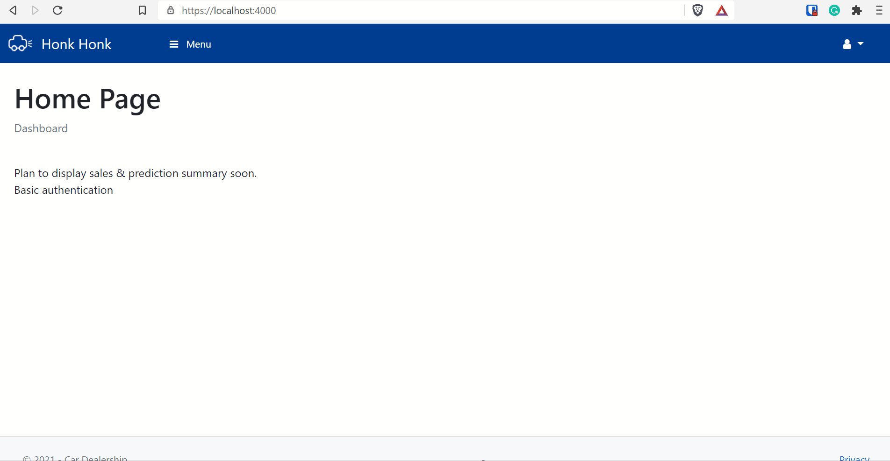

# car-dealership-application
- A proof of concept/simple prototype for ASP.NET Core application integrated with client side frameworks libraries.
- **Important**: Note this repository is related to these two repositories [here](https://github.com/polarBearYap/car-dealership-automl) and [here](https://github.com/polarBearYap/car-dealership-flask-api). This repository is foucsed on web development that uses the deployed car dealership Flask API in Azure.. Be sure to check out all of them.

## Table of Contents
* [Learning Purpose](#Learning-Purpose-)
* [Technology Applied](#Technology-Applied-)
* [Third-party npm libraries](#Third-party-npm-libraries-Credits-to-them-)
* [Software Requirement](#software-requirement-windows-10-environment-)
* [Project setup](#Project-setup-)
* [Demo](#Demo)
* [Future Works](#Future-Works-)

## Learning Purpose &#128218;
- To practice essential skills for client-side web development using libraries like Babel, Webpack, Typescript, React, ...
- To practice essential skills for server-side web development in ASP.NET.
- To prepare for my future career as full-stack web developer &#129321;.

## Technology Applied &#129302;
- [ASP.NET Core MVC 5.0](https://docs.microsoft.com/en-us/aspnet/core/mvc/overview?view=aspnetcore-5.0)
- [Typescript](https://www.typescriptlang.org/): Perform type checking to produce more robust Javascript code

## Third-party npm libraries (Credits to them)
- [Webpack](https://webpack.js.org/): To compile Typescript to Javascript
- [gulp](https://gulpjs.com/): To automate deployment workflow like compiling Typescript before clean/build 
- [@types libraries](https://www.typescriptlang.org/dt/search): To provide TypeScript support for javascript-only libraries
- [Chart.js](https://www.chartjs.org/): To create beautiful charts with mature plugins found [here](https://github.com/chartjs/awesome#plugins)
- [chartjs-plugin-zoom](https://github.com/chartjs/chartjs-plugin-zoom): To provide zoom functionalities for chart.js
- Bootstrap & JQuery: To build responsive & Interative Web
- [fontawesome](https://fontawesome.com/v4.7/icons/): To provide UI icons 

## Software Requirement (Windows 10 Environment) &#128187;
- Visual Studio 2019 Community Edition
- Node.js: To use npm package manager
- IIS manager: To host car price prediction flask API in local machine for faster testing 

> Read [here](https://stackoverflow.com/questions/30901434/iis-manager-in-windows-10) on how to enable IIS manager in Windows 10. 

## Project setup &#x2699;
1. Open the project in Visual Studio 2019 by clicking on the `CarDealershipWebApp.sln`.
2. Once open, `libman.json` right-click the libman.json file in Solution Explorer and select the "Restore Client-Side Libraries" option.
3. Then, open the cmd and navigate project root directory, then type `npm install`. This will install all the npm packages into `node_modules` folder.
4. Bind the Gulp task is to "Before Build/After Build/Clean". Follow the steps in [here](http://www.codedigest.com/quick-start/14/using-of-gulp-gulpfilejs-in-visual-studio-2017). 

## Demo
1. Demo for car price prediction
    - 

2. Demo for basic functionalities like CRUD
    - 

## Future Works &#128302;
1. Learn [React](https://reactjs.org/) and learn to develop ASP.NET Core application with React framework.
2. Learn to use [Babel](https://babeljs.io/) with Typescript and Webpack to compile to Javascript code that is compatible to older browser (hopefully Internet Explorer &#129315;).
3. Learn how to deploy the whole web application to Azure App service using Docker.
4. Master webpack. (e.g. Learn on how to bundle Typescript/css files into multiple entry files for different [areas](https://docs.microsoft.com/en-us/aspnet/core/mvc/controllers/areas?view=aspnetcore-5.0).
5. Explore various APIs available in ASP.NET Core like [Identity](https://docs.microsoft.com/en-us/aspnet/core/security/authentication/identity?view=aspnetcore-5.0&tabs=visual-studio).
